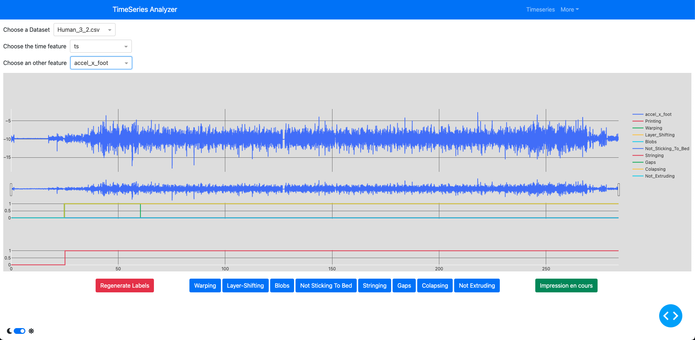
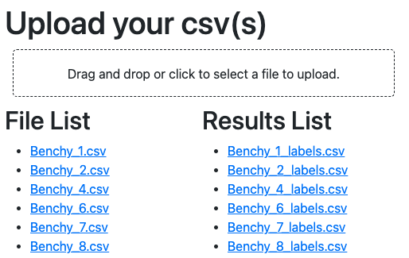

# TimeSeries-Analysis-Dash-App

## Launch app

```bash
python ./app.py
```

## Functionning

This app allows you to upload .CSV files :<br><br>


Once it is uploaded, go to "**_Timeseries_**" tab

- Select the .CSV file you have uploaded
- Select the Timestep column name
- Select the Series you want to display



You can then select portions of the series and click on the buttons under to label each subdivisions you made :


You can then download the labels results from home page (just click on the corresponding filename)


